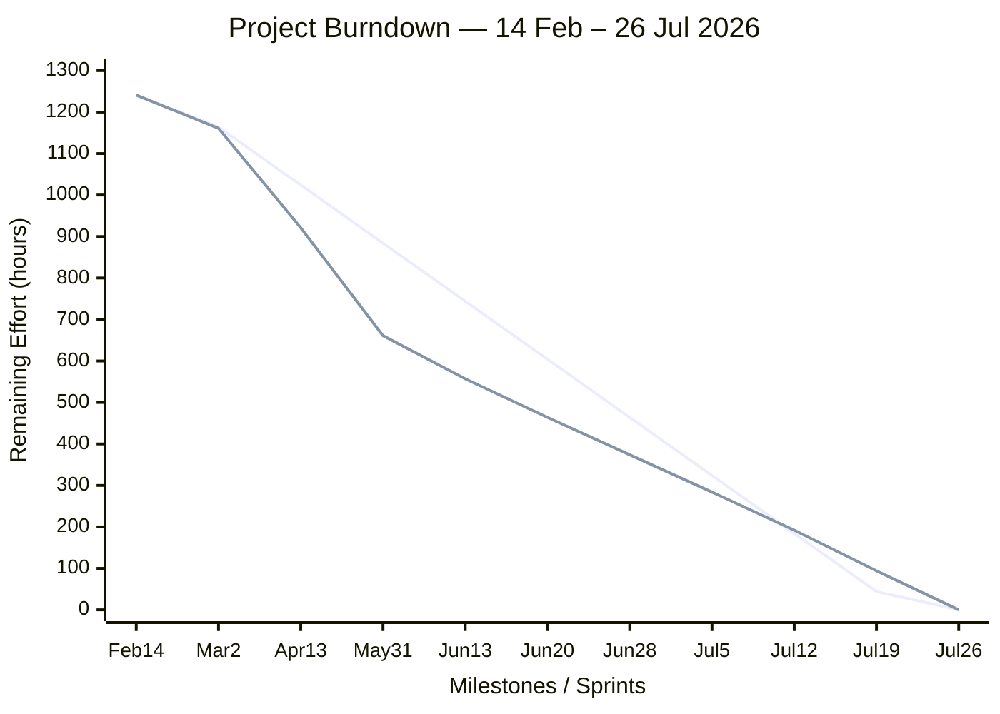

# Burndown Chart — NamingChecker (14 Feb – 26 Jul 2026)

```mermaid
xychart-beta
    title "Project Burndown — 14 Feb – 26 Jul 2026"
    x-axis "Milestones / Sprints" [Feb 14, Mar 2, Apr 13, May 31, Jun 13, Jun 20, Jun 28, Jul 5, Jul 12, Jul 19, Jul 26]
    y-axis "Remaining Effort (hours)" 0 --> 1300
    line "Ideal Burn" [1241, 1164, 1024, 884, 744, 604, 464, 324, 184, 44, 0]
    line "Actual Planned" [1241, 1161, 921, 661, 557, 464, 374, 284, 192, 94, 0]
```
