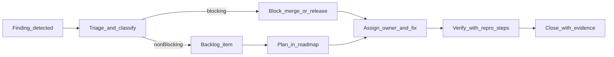

# Quality Plan

## Purpose
This plan defines how quality is managed in NamingChecker: an internal MTS service for naming and logo similarity checks. It reflects the real project constraints: internal-only deployment, no runtime external internet access, A100 GPU target environment, FastAPI backend, PostgreSQL/ClickHouse storage, and ML-based ranking.

## Project Context
NamingChecker runs on the internal corporate network with **no external internet calls during service operation**; models and dependencies must be preloaded. The core stack is **Python 3.10–3.11**, **FastAPI**, **PostgreSQL**, **ClickHouse**, and **Docker**; the container baseline is **Python 3.11**, and tooling targets **Ruff `py311`** and **mypy `python_version = 3.11`**. Target hardware includes **NVIDIA A100 PCIe 80GB** for ML inference. Functional scope covers registration check (Russia, Nice/MKTU classes, top-200 ranked candidates), text trademark misuse (pairwise similarity), logo comparison, and Stage 2 results via webhook (partial results and unordered delivery allowed). The single approved product baseline is [requirements.md](requirements.md); broader quality attributes and scenarios are aligned with [quality_management.md](quality_management.md).

## Quality Requirements (ISO 25010)
The table below maps product quality attributes to measurable targets, tools, and whether the item is enforced as a **CI gate** (blocks merge/build), a **release gate** (blocks deploy/demo), or **monitored** (alerts / reporting without automatic block).

| Attribute | Metric | Threshold | Tool | CI / release |
|---|---|---|---|---|
| Functional suitability | Text naming search quality (labeled pairs) | Accuracy ≥ 85% hits on the customer's sample | Custom evaluation scripts vs baseline | Release (regression) |
| Functional suitability | Logo similarity quality | Precision / recall / F1 per agreed threshold | Custom evaluation scripts vs baseline | Release (regression) |
| Performance efficiency | Full query end-to-end latency | &lt; 2 minutes | Timing harness / logs | Release |
| Performance efficiency | Stage 1 internal response | P95 = 60s, P99 = 100s | Staged-flow timing | Release |
| Performance efficiency | Stage 2 webhook delivery | SLA ≤ 120s | Webhook / async timing | Release |
| Reliability | Service availability | 99.5%–99.9% | Runtime monitoring | Monitored |
| Reliability | Async external-source calls | Up to 3 retries, exponential backoff, 60s timeout per source | Integration tests | PR |
| Reliability | Async monitoring | Delay alert &gt; 5 min; fail-rate &gt; 2%; DLQ &gt; 5 messages | Integration tests + monitoring | Monitored |
| Maintainability | Style / lint | 0 Ruff violations (CI profile) | `ruff check` | PR |
| Maintainability | Static typing | 0 mypy errors (scoped config) | `mypy` | PR |
| Maintainability | Line coverage | ≥ 80% on critical packages | `pytest-cov` | PR (when `--cov-fail-under` enabled in CI) |
| Security | High-severity issues | 0 high-severity findings | `bandit` (planned in dev deps; run in CI when added) | PR |
| Compatibility | Python runtime | `requires-python` ≥3.10 and &lt;3.12; container 3.11 | `pyproject.toml`, Dockerfile | Build |
| Operational constraint | No runtime external internet | No egress to public internet in operation | Isolation / network tests | Release |

## 1. Activities
We use four practical quality activities:
- **Inspection** — requirements, API contracts, pull requests.
- **Testing** — preprocessing, similarity modules, API flows, end-to-end scenarios.
- **Analysis** — code quality, typing, coverage, latency, model metrics.
- **Demo** — milestone validation with stakeholders, especially legal/domain experts.

These activities fit the project because it combines backend logic, ML quality, and business-critical review.

## 2. Interactions
Quality is embedded into the normal workflow:
- source artifacts are updated first;
- implementation follows approved baseline only;
- work goes through feature branches and pull requests;
- CI gates run before merge and deployment;
- quality results are reviewed during planning, evaluation, and release decisions.

### Living quality process (who triggers what)
This section describes the *operational* quality loop: who initiates activities, what artifacts are produced, and how decisions are made.

#### Cadence and triggers
- **Per commit / before push** (author): run Gate 0 checks locally (format/lint/typecheck) and fix findings before requesting review.
- **Per pull request** (author + reviewer): Gate 1 must pass; reviewers check the PR against the checklist; defects are logged/returned to author for fix.
- **Per model or dataset change** (ML owner + backend): run ML regression evaluation and compare to baseline; if regression is detected, open a defect and block Gate 2 until resolved or explicitly accepted.
- **Per release candidate / demo** (release owner): run Gate 2 suite (quality regression + latency + isolation); record evidence in release notes (or equivalent internal artifact).
- **Post-deploy** (on-call / whole team): monitor Gate 3 signals; create incidents/defects when thresholds are exceeded and decide rollback/hotfix.

#### Responsibility
R = Responsible (does the work), A = Accountable (final decision), C = Consulted, I = Informed.

| Activity / decision | R | A | C | I |
|---|---|---|---|---|
| Update requirements baseline ([requirements.md](requirements.md)) | PM/Analyst | PM/Analyst | Team | Stakeholders |
| Gate 0 (local lint/typecheck) | PR author | PR author | — | Reviewer |
| Gate 1 (PR CI + review) | PR author | Reviewer (merge approval) | Team | PM/Analyst |
| Unit/integration tests for backend changes | Backend engineer | Backend engineer | Reviewer | Team |
| E2E validation for critical flows | Backend engineer | Release owner | PM/Analyst | Team |
| ML quality regression vs baseline | ML engineer (module owner) | ML engineer (module owner) | Backend | Team |
| Latency regression investigation | Backend engineer | Release owner | ML | Team |
| Isolation / “no external internet” verification | Backend engineer | Release owner | DevOps/Infra (if available) | Team |
| Defect triage and priority | Whole team | PM/Analyst | Stakeholders | Team |
| Release go/no-go | Release owner | Release owner | PM/Analyst + module owners | Stakeholders |

## 3. Artifacts
Quality activities cover:
- backend code;
- preprocessing logic;
- text and logo similarity modules;
- REST API endpoints;
- DB queries and ranking logic;
- requirements and roadmap artifacts;
- configuration and deployment files;
- test datasets and evaluation scripts.

## 4. Timing
Quality activities happen continuously:
- **Before implementation** — review requirements and acceptance logic.
- **During implementation** — PR review, local checks, unit/integration tests.
- **Before merge** — CI checks and required gates.
- **Before milestone demo/release** — end-to-end validation, metric review, latency check.
- **After major model/data changes** — regression checks on labeled datasets.

## 5. Responsibility
- **ML Engineer №1 (Alexander)** — logo model quality and visual similarity evaluation.
- **ML/NLP Engineer №2 (Daniel)** — phonetic, semantic, and final text-score quality.
- **Backend Engineer №1 (Ilya)** — API, preprocessing, text metrics, DB search, integration quality.
- **Backend Engineer №2 (Vladimir)** — searching and parsing.
- **PM / Analyst (Daria)** — requirements consistency, acceptance alignment, stakeholder validation.
- **Whole team** — review, regression prevention, release readiness.

### Code review checklist
Every pull request should be checked before approval:
- Local **Ruff** and **mypy** clean; **pytest** passes for affected areas.
- New or changed behavior covered by **unit** and/or **integration** tests where risk warrants it.
- API or contract changes reflected in [requirements.md](requirements.md) and architecture / API artifacts per the requirements management strategy.
- No new **runtime** dependency on the public internet; models and data remain **preloaded** / internal.
- **Latency-sensitive** paths reviewed (DB access patterns, batch sizes, GPU use, hot paths).
- **Security**: no secrets in code; input validation enforced (e.g. at least one Nice class `mktu_codes` where required); **Bandit** clean when the tool is wired into CI.
- **Webhook / async** behavior aligns with partial results and unordered Stage 2 delivery where applicable.

## 6. Extent
We use risk-based coverage:
- unit tests for core backend and preprocessing logic;
- integration tests for API and DB-backed flows;
- end-to-end tests for registration check, text infringement, and logo comparison;
- labeled dataset evaluation for text and logo similarity;
- regression testing after changes in models, scoring, or preprocessing.

Critical modules must be tested directly.

### Testing strategy
- **Unit tests** — preprocessing (normalization, tokenization), scoring helpers, ranking and aggregation logic, request validation, webhook payload assembly, pure business rules.
- **Integration tests** — FastAPI routes with **HTTPX** / test client; PostgreSQL and ClickHouse-backed flows with test fixtures or containers as available.
- **End-to-end tests** — full flows for `/api/v1/registration-check`, `/api/v1/text-infringement`, `/api/v1/logo-comparison`, and `/api/v1/webhooks/stage2-results` (including Nice-class prefilter and top-200 behavior where in scope).
- **ML evaluation** — labeled naming pairs and labeled logo pairs; compare metrics to a **stored baseline**; block release on unexplained regression.
- **Latency** — measure full query, Stage 1 (P95/P99), and Stage 2 delivery against [requirements.md](requirements.md) targets on representative hardware (A100 where relevant).
- **Isolation** — verify **no runtime egress** to external internet (aligned with technical constraints in [requirements.md](requirements.md)).

## 7. Cost / Time
Quality effort is planned as part of delivery:
- PR review and local validation — part of every task;
- automated checks — part of every merge;
- dataset evaluation and tuning — part of model iterations;
- milestone demos and acceptance review — part of roadmap checkpoints.

The largest quality effort is allocated to preprocessing, similarity accuracy, and latency, because these are the main project risks.

### Practical effort budgeting (typical, per PR / per release)
These are **planning** estimates to make the cost visible; actuals are tracked during execution and used to adjust the plan.

- **Gate 0 (local checks + fix)**: ~5–20 min per PR (more if large refactor).
- **Code review + defect fix loop**: review ~15–40 min; author fix/retest ~15–60 min depending on findings.
- **Unit/integration tests authoring**: ~30–120 min per feature/bugfix, depending on DB/async complexity.
- **E2E validation for critical flows**: ~30–90 min per release candidate (smoke + critical scenarios).
- **ML regression evaluation** (text or logo): ~30–120 min per model/dataset change (run + compare + analyze errors).
- **Latency validation**: ~30–90 min per release candidate on representative environment.
- **Isolation validation**: ~15–45 min per release candidate (environment-dependent).

Decision rule: if Gate 2 repeatedly consumes more than ~0.5–1 engineer-day per release, the team prioritizes automation and/or narrows the gate to the highest-risk scenarios while keeping mandatory thresholds.

## 8. Tools
Commands below are run from the **backend** service root (where `Makefile` and `pyproject.toml` live). Config anchors refer to [backend/pyproject.toml](../backend/pyproject.toml), [backend/Makefile](../backend/Makefile), and [backend/.github/workflows/pull-request-ci.yml](../backend/.github/workflows/pull-request-ci.yml).

| Requirement | Tool | Command (examples) | Config anchor |
|---|---|---|---|
| Formatting | Ruff | `make ruff_format` or `python -m ruff format src` | `[tool.ruff]`, `[tool.ruff.format]` |
| Lint | Ruff | `make ruff_lint`, `make ruff-ci`, or `python -m ruff check src` | `[tool.ruff]`, `[tool.ruff.lint]` |
| Static typing | mypy | `make mypy`, `make mypy-ci`, or `python -m mypy` | `[tool.mypy]` |
| Unit / integration tests | pytest | `make test`, `make test-ci`, or `python -m pytest` | `[tool.pytest.ini_options]` |
| Coverage | pytest-cov | Included in pytest `addopts` (`--cov=naming_check_backend`); add `--cov-fail-under=80` in CI when adopted | `[tool.coverage.run]`, `[tool.coverage.report]` |
| Security | Bandit | `bandit -r src/naming_check_backend` (when dev dependency added) | Project policy / future `[tool.bandit]` |
| PR CI bundle | Make + GitHub Actions | `make ci` (Ruff + mypy + tests) | `Makefile` job `ci`; workflow `pull-request-ci.yml` |
| Container parity | Docker / Compose | `make docker-test`, `make docker-auto_test` | `Dockerfile`, compose files |
| ML quality | Custom scripts | Dataset eval vs checked-in baseline | `Documentation/`, `backend/` eval scripts |
| Latency | Custom harness / logs | E2E timing for full / Stage 1 / Stage 2 | Observability / test harness |

Project-specific evaluation also includes:
- text similarity quality on labeled naming pairs;
- logo similarity quality on labeled image pairs;
- latency measurement for the full query flow.

## 9. Training
The team needs working knowledge in:
- FastAPI and backend testing;
- PostgreSQL / ClickHouse query validation;
- ML evaluation metrics;
- handling labeled datasets;
- CI usage and debugging;
- project-specific legal meaning of “similar” vs “not similar”.

Calibration with legal experts is required because model quality depends on expert interpretation.

## 10. Blocking Rules
The following rules block merge or release:
- requirement changes are not synchronized with baseline artifacts;
- required CI checks fail;
- critical tests fail;
- API behavior conflicts with approved contracts;
- regression on agreed quality metrics is not explained and accepted;
- release candidate does not meet mandatory operational constraints.

## 11. Measurements
The project tracks:
- **Accuracy / Precision** for naming search;
- **recall / F1** where relevant for infringement evaluation;
- **latency** for full query flow and staged responses;
- **test pass rate**;
- **coverage trend**;
- **defect / regression count**;
- **data freshness** for offline-loaded external sources;
- **CI status** for every merge candidate.

### Monitoring and visibility
- **CI dashboard** — pass rate per workflow, flake rate on main, time-to-green for PRs, coverage trend, Ruff/mypy failure trend, linked artifacts (coverage HTML where published).
- **ML quality dashboard** — accuracy / precision / recall / F1 per release vs frozen baseline on labeled text and logo sets.
- **Latency dashboard** — full-query duration, Stage 1 P95/P99, Stage 2 delivery SLA; slice by endpoint and load scenario.
- **Async health** — retry counts, per-source timeouts, fail-rate vs 2% alert, DLQ depth vs 5-message threshold, delay vs 5-minute alert (per [requirements.md](requirements.md)).
- **Data freshness** — time since last successful offline refresh of external-derived sources (aligned with [quality_management.md](quality_management.md) where applicable).

## Quality Gates
Quality gates integrate V&V with the development workflow. **Entry** = minimum inputs to start the gate; **Exit** = conditions to pass the gate.

```mermaid
flowchart LR
    Dev[Developer change] --> Gate0["Gate 0: Pre-commit"]
    Gate0 --> PR[Pull Request]
    PR --> Gate1["Gate 1: PR CI"]
    Gate1 --> Merge[Merge to main]
    Merge --> Candidate[Release candidate]
    Candidate --> Gate2["Gate 2: Pre-release"]
    Gate2 --> Deploy[Internal deploy]
    Deploy --> Gate3["Gate 3: Runtime monitoring"]
```

### Defect lifecycle (how defects flow)
All findings (from CI, tests, reviews, monitoring, or ML evaluation) are treated as defects with a clear owner and status.

**Classification rules**:
- **Blocking (must fix before merge/release)**: CI required checks fail; critical flow broken; regression vs agreed ML baseline; latency budget violated; isolation violated; security high-severity (when scanner enabled).
- **Non-blocking**: minor style nits, low-risk refactors, documentation improvements, performance optimizations without SLA breach — tracked as backlog with owner.

**Required defect fields** (in issue tracker or PR thread): reproduction steps, expected vs actual, severity, owner, link to evidence (logs, CI run, eval report), and closure criteria.

## Evidence of execution (what was actually done)
This QP is a plan, but it must be backed by reproducible evidence. Current project evidence artifacts include:
- **CI pipeline** running `make ci` on pull requests: [backend/.github/workflows/pull-request-ci.yml](../backend/.github/workflows/pull-request-ci.yml).
- **Quality commands** and targets: [backend/Makefile](../backend/Makefile).
- **Lint/type/test configuration**: [backend/pyproject.toml](../backend/pyproject.toml) (`[tool.ruff]`, `[tool.mypy]`, `[tool.pytest.ini_options]`, coverage config).
- **Documented quality objectives and scenarios**: [quality_management.md](quality_management.md).
- **Baseline requirements**: [requirements.md](requirements.md).

How to reproduce evidence locally (backend):
- Run `make ci` to reproduce the PR required checks.
- Run `make test` for local test execution with coverage reporting configured in `pyproject.toml`.

## SQR lessons applied (from practice to IPP)
The IPP QP is not a generic template: it was adapted to real constraints and risks that were not present in the practice project.

- **From “toy latency” to staged SLA**: instead of generic HTTP P95 thresholds, the plan uses staged targets (Stage 1 P95/P99, Stage 2 SLA, full-query budget) aligned with ML + DB workloads.
- **From “unit tests only” to multi-layer V&V**: explicit split into unit, integration, E2E, ML regression, latency, and isolation testing, because failures can originate in models, DB, async delivery, or infrastructure constraints.
- **From “one gate” to tiered gates with entry/exit**: Gate 0–3 make clear where defects are caught, who acts, and what blocks merge vs release vs triggers monitoring.
- **From “code-only quality” to process quality**: RACI + defect lifecycle are included so the defense can explain who triggers what and how defects flow, not just list tools and thresholds.

### Gate 0 — Pre-commit (developer machine)
- **When:** Before every push or share of a branch.
- **Entry:** Working tree with intended changes.
- **Blocks:** Ruff format/lint failures; mypy errors on scoped packages.
- **Exit:** `make lint` (or equivalent: format + Ruff + mypy) succeeds locally.
- **Purpose:** Catch style and typing issues before CI cost and reviewer time.

### Gate 1 — Pull request (pre-merge)
- **When:** Before merging a pull request.
- **Entry:** PR opened; CI can run (e.g. `make ci` in GitHub Actions).
- **Blocks:** Failing Ruff, mypy, or pytest; coverage below **80%** when `--cov-fail-under=80` is enabled in CI; missing required code review approval; high-severity **Bandit** findings when Bandit is in CI; requirement or contract drift vs [requirements.md](requirements.md) without approved baseline update.
- **Exit:** Green required checks; at least **one** approving review; baseline artifacts consistent with changes.
- **Purpose:** Keep mainline integratable and aligned with the approved requirements.

### Gate 2 — Pre-release / pre-deploy
- **When:** Before internal deployment or milestone demo labeled as release-quality.
- **Entry:** Release candidate build (container or tagged revision) on target or staging environment.
- **Blocks:** Unexplained regression on **labeled** text or logo metrics vs agreed baseline; full-query latency over **2 minutes**; Stage 1 **P95/P99** or Stage 2 **SLA** over budget; **isolation** test failure (runtime external internet); critical user flows broken; roadmap / changelog not updated for the version where the team tracks releases.
- **Exit:** Signed-off metrics report (or equivalent team agreement); acceptance aligned with [quality_management.md](quality_management.md) acceptance rule (requirement → test → threshold).
- **Purpose:** Ensure ML quality, latency, and operational constraints hold in conditions close to production.

### Gate 3 — Runtime monitoring (post-deploy)
- **When:** Continuously after deploy.
- **Entry:** Service running in internal environment.
- **Blocks:** Not a hard merge block; **triggers** investigation and possible rollback when delay **&gt; 5 minutes**, async fail-rate **&gt; 2%**, or DLQ **&gt; 5** messages (per [requirements.md](requirements.md)).
- **Exit:** On-call / team acknowledges alert; corrective action or threshold exception documented.
- **Purpose:** Protect reliability and async correctness in production-like operation.

## Success Criteria
An iteration or release is **quality-successful** when:
- **Gate 1** and **Gate 2** have passed for the candidate revision.
- **Line coverage** ≥ **80%** on critical backend packages (when enforced in CI).
- **Text** quality: accuracy ≥ **85%** on the agreed labeled naming evaluation; **logo** metrics meet the agreed threshold on labeled data.
- **Latency:** full query **&lt; 2 min**; Stage 1 **P95 = 60s**, **P99 = 100s**; Stage 2 delivery **≤ 120s**, per [requirements.md](requirements.md).
- **Flows verified:** registration check (Nice classes, top-200), text infringement (pairwise), logo comparison, Stage 2 webhook (partial / unordered acceptable).
- **Operational compliance:** no runtime dependence on the public internet; **A100** / internal stack assumptions respected.
- **Security:** no high-severity issues from automated scanning when Bandit is enabled.
- **Traceability:** roadmap / changelog (or team-equivalent release notes) updated for the delivered scope.
